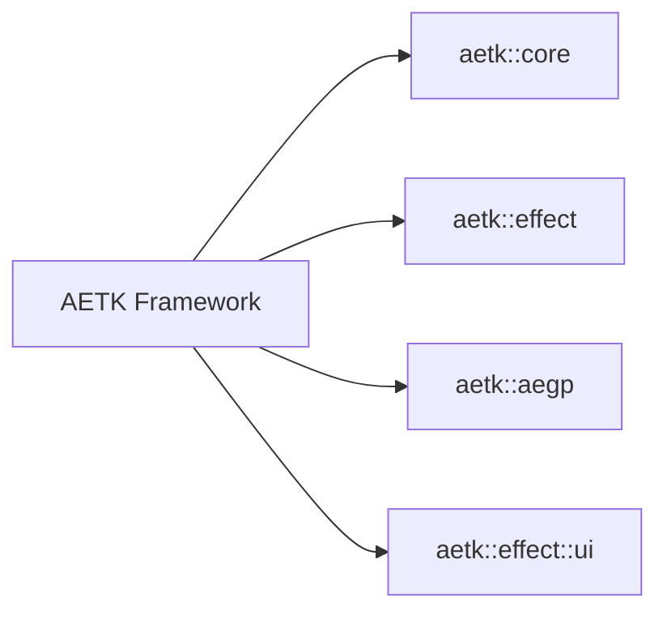
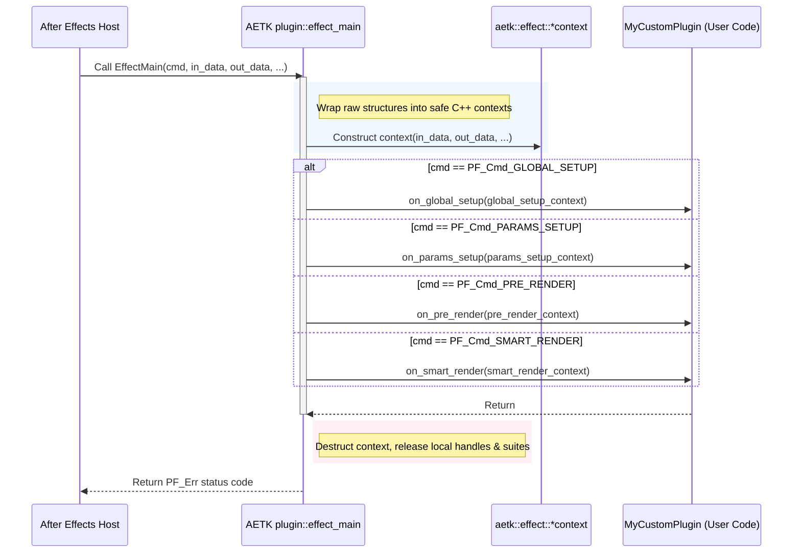

# AETK 2.0 Architecture Overview

This document provides a high-level architectural map of the **AETK 2.0** framework, explaining how its component systems interact with the After Effects SDK.

---

## Design Philosophy

The Adobe After Effects SDK is a procedural C-based API designed in the 1990s. Developing plugins directly with it is challenging because:

* **Manual Lifecycles**: Developers must check in/out parameter layers, allocate memory handles, and lock/unlock suites manually. Forgetting to do so results in memory leaks or host-side crashes.
* **Lack of Thread Safety**: Modern Multi-Frame Rendering (MFR) concurrently calls plugins on different threads, making static/global variables unsafe.
* **Boilerplate**: A single plugin requires large `switch-case` entry points (`EffectMain`), manual parameter registration loops, and multiple branches to handle 8-bit, 16-bit, and 32-bit pixel formats.

**AETK 2.0** is an RAII-first, type-safe C++20 header-only abstraction layer built to solve these issues. It encapsulates raw C structures in C++ wrappers, automates host event dispatching, and provides a uniform, format-agnostic pixel access interface.

---

## Namespace & System Organization

AETK is structured into logical namespaces representing different parts of the After Effects ecosystem:

### `aetk::core` (Core Utilities)

Provides low-level wrappers and utilities used across the entire framework:

* **RAII Suites (`aetk::core::suite<T>`)**: Safe retrieval and automatic disposal of Adobe SDK suites via PICA basic suite calls.
* **Memory Management (`handle`, `mem_handle`)**: Standard C++ wrappers for After Effects' legacy `PF_Handle` memory tracking.
* **Diagnostics & Profiling (`scoped_timer`, `logger`)**: Microsecond-resolution scope profiling macros and logging interfaces.
* **Utilities**: Compile-time stable FNV-1a hashing (`hash_string`), mathematical structures (`point`, `rect`), and exception mappings.

### `aetk::effect` (Effect Plugin Framework)

Wraps standard After Effects effects (filters) that process layers and parameters:

* **The Plugin Base (`aetk::effect::plugin<T>`)**: A CRTP-based class that maps the monolithic `EffectMain` entry point into individual, type-safe callbacks.
* **Context wrappers (`smart_render_context`, `pre_render_context`, etc.)**: Stack-allocated wrappers providing clean interfaces to access host data depending on the command being processed.
* **`smart_world`**: The primary pitch-aware image surface wrapper supporting CPU/GPU residency transfers (`.to()`), format conversions, and deep cloning (`.clone()`).
* **Pixel Pipeline (`pixel_accessor`, `pixel_transaction`, `visit_pixel_format`)**: Double-dispatch template patterns to write single, format-agnostic loops that run across ARGB 8-bit, 16-bit, and 32-bit float formats.
* **Tensors (`tensor`, `tensor_view`)**: A zero-overhead multidimensional array pipeline for machine learning integrations and custom GPU CUDA kernels.

### `aetk::aegp` (After Effects General Plugins)

Encapsulates AEGPs, which are hook-based plugins that can control application-wide features, menus, keyframes, and composition hierarchies:

* **The AEGP Plugin Base (`aetk::aegp::plugin<T>`)**: Base class managing registration and basic lifecycle hooks.
* **DOM Wrappers (`comp`, `footage`, `layer`, `stream`, `keyframe`, `mask`, `item`)**: An object-oriented document-model mapping After Effects project hierarchies.
* **Menu Command Hooks (`command`)**: Clean class structures to bind menu items to C++ callbacks.

### `aetk::effect::ui` (Custom UI & Vector Drawing)

Builds on top of Drawbot and Custom UI callbacks to provide interactive overlays:

* **The Widget System (`widget`, `panel`)**: A modern, flexbox-inspired GUI framework to arrange buttons, sliders, text inputs, and joystick coordinates.
* **Drawbot Wrapper (`canvas`, `supplier`)**: Vector drawing wrappers (`fill_rect`, `draw_line`, `draw_circle`, `fill_path`, `draw_string`).
* **Theme Palettes (`theme`)**: Pre-configured colors and fonts matching After Effects' light/dark user interface.

---

## 3. Execution Flow

When After Effects interacts with your plugin, it calls a single C entry point function `EffectMain`. AETK intercepts this entry point using the CRTP `plugin<T>::effect_main` dispatcher and routes the commands:

---

## 4. RAII & Memory Resource Ownership

The core tenet of AETK's memory system is: **Resource Acquisition Is Initialization (RAII)**.
Every heavy After Effects resource is wrapped in an owning class container whose destructor handles the required host check-in or deallocation callback automatically on scope exit.

| Resource Type | SDK C handle | AETK Owner Class | Automatic Action on Destruction |
| :--- | :--- | :--- | :--- |
| **Checked-out parameter layer** | `PF_ParamDef` | `smart_world` (`LAYER_PARAM_CHECKOUT`) | Calls `PF_CHECKIN_PARAM()` |
| **Smart Render layer pixels** | `PF_EffectWorld*` | `smart_world` (`LAYER_PIXELS`) | Calls `PF_SmartRenderCallbacks->checkin_layer_pixels()` |
| **CPU Scratch World** | `PF_EffectWorld*` | `smart_world` (`SCRATCH_CPU`) | Calls `PF_WorldSuite->dispose_world()` |
| **GPU Scratch World** | `PF_EffectWorld*` | `smart_world` (`SCRATCH_GPU`) | Calls `PF_GPUDeviceSuite->DisposeGPUWorld()` |
| **Host Memory Allocations** | `PF_Handle` | `aetk::core::mem_handle` | Calls `PF_HandleSuite->host_dispose_handle()` |
| **SDK Suite Lookups** | `void*` pointer | `aetk::core::suite<T>` | Disposes/decrements suite registration reference |

### Move-Only Semantics

Because duplicate copies of `smart_world` or `mem_handle` would trigger double-free crashes when both instances attempt cleanup on destruction, AETK marks their copy constructors and copy assignment operators as **`= delete`**. They can only be **moved** (`std::move`), transferring resource ownership safely between contexts.
