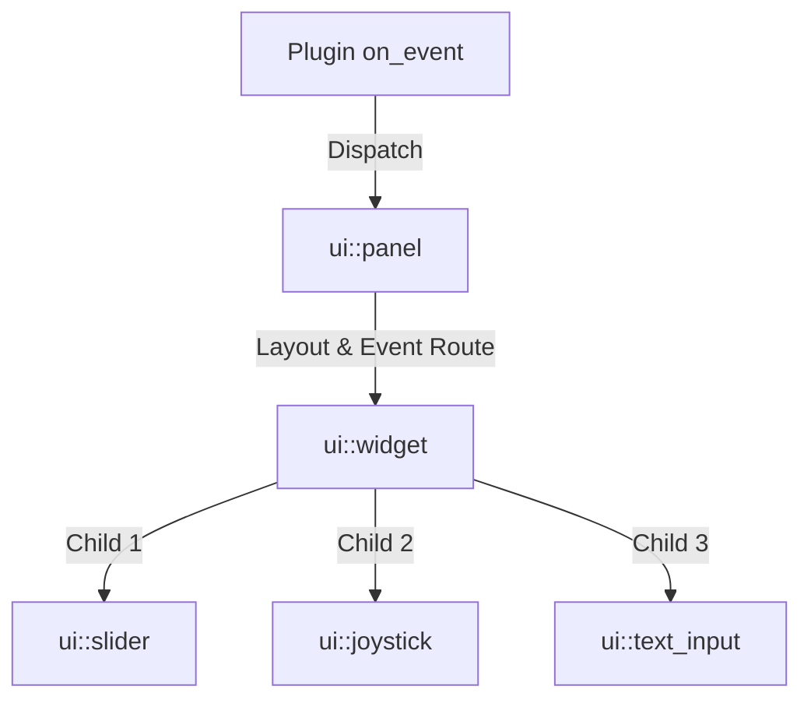

# Custom UI & Widget Framework in AETK 2.0

AETK 2.0 modernizes After Effects' low-level, callback-driven Custom UI events and drawing APIs (such as Drawbot) into a structured, Flexbox-like object-oriented UI framework.

---

## 1. Core Architecture

The AETK UI framework replaces procedural, screen-space switches and drawing calls with a hierarchy of classes:



### A. The Base `widget` Class
Every UI element inherits from **`aetk::effect::ui::widget`**. A widget manages:
* **Layout Specifications (`layout_props`)**: Flex grow factors, padding, minimum/maximum sizes, and resize toggles.
* **Computed Bounds (`bounds_rect`)**: Automatically calculated absolute layout coordinates (`x`, `y`, `w`, `h`) computed during layout passes.
* **Focus & Interaction States**: Toggles for `hovered`, `pressed`, `visible`, `enabled`, and `focused`.
* **NVI Pattern (Non-Virtual Interface)**: Public lifecycle interfaces (`measure()`, `do_layout()`, `paint()`, `hit_test()`) execute standard bounds/safety checks in the base class, delegating custom behaviors to overrides (`measure_impl()`, `paint_impl()`, `on_click_impl()`).

### B. The `panel` Manager
The `ui::panel` acts as the root of the widget tree. It is initialized in your plugin's parameters and manages:
* Absolute positioning and screen offsets.
* Flexbox layout calculations.
* Routing events from the After Effects host.

---

## 2. Event Dispatching: `interaction_context`

Instead of handling raw After Effects event structs (`PF_EventExtra`) inside large `switch` statements in `EffectMain`, AETK wraps them in a unified **`interaction_context`** object.

When the host triggers `PF_Cmd_EVENT`, AETK routes the call to `panel::dispatch(ctx)`, which executes one of the following handlers:

* **`handle_draw(ctx, frame)`**: Refreshes flexbox layout measurements and paints widgets using a Drawbot canvas.
* **`handle_click(ctx)`**: Traverses the widget hierarchy via `find_widget_at` and triggers the target widget's `on_click_impl`.
* **`handle_drag(ctx)`**: Sends ongoing drag offsets to the pressed widget (e.g. tracking a slider knob or trackball).
* **`handle_keydown(ctx)`**: Routes key presses directly to the active focused widget (e.g. typing inside a text input field).
* **`handle_mouse_exited(ctx)`**: Safely resets hovering and active states.

> [!CAUTION]
> **InvalidateRect Event Validation Rules**:
> After Effects prohibits calls to `PF_InvalidateRect` during `PF_Event_DRAW`, `PF_Event_ADJUST_CURSOR` (hover moves), `PF_Event_MOUSE_EXITED` (hover exits), `PF_Event_KEYDOWN`, and plugin teardown. Invoking it during these events results in internal verification failures or crashes.
> 
> *AETK Design Solution*: The framework whitelists `PF_InvalidateRect` calls strictly to `DO_CLICK`, `DRAG` (except the final frame), and `IDLE` event scopes. During draw or hover events, AETK automatically bypasses the suite call and sets the `PF_EO_UPDATE_NOW` flag in the output event flags to safely request a redraw.

---

## 3. High-Performance Vector Drawing (Drawbot)

AETK wraps After Effects' native Drawbot vector rendering API (`PF_DrawbotSuite1`) in a high-level wrapper to make drawing simple and cross-platform:

* **`drawbot::canvas`**: Exposes vector drawing API methods (such as `draw_line`, `fill_rect`, `draw_circle`, `fill_path`, and `draw_string`).
* **`drawbot::supplier`**: Manages the lifecycle of brushes, pens, fonts, and path geometries.
* **`theme`**: Holds unified, host-matching color palettes (e.g. borders, shadows, backgrounds, text colors) to keep your custom overlays looking consistent with After Effects' native dark/light user interface themes.

---

## 4. Code Example: Custom Overlay Integration

Integrating custom interactive widgets into your plugin layout is extremely clean:

```cpp
#include <aetk/effect.hpp>
#include <aetk/effect/ui.hpp>

using namespace aetk::effect;
using namespace aetk::effect::ui;

class my_custom_ui_plugin : public plugin<my_custom_ui_plugin> {
public:
    static void on_params_setup(const params_setup_context& ctx) {
        // 1. Tell After Effects to enable custom UI drawing
        ctx.register_custom_ui(PF_CustomEFlag_EFFECT);

        // 2. Add widgets (AETK handles registration, layout, and event loops automatically)
        ui::add_widget<slider<float>>(ctx, "Radius Scale", "Radius", 0.0f, 100.0f, 50.0f);
    }

    static void on_smart_render(const smart_render_context& ctx) {
        // 3. Query the widget's persistent state during render commands
        auto radius_param = ctx.param<arbitrary_param<ui::slider_data<float>>>("Radius Scale");
        float radius = radius_param.value()->value;
        
        // Render logic using radius...
    }
};
```
